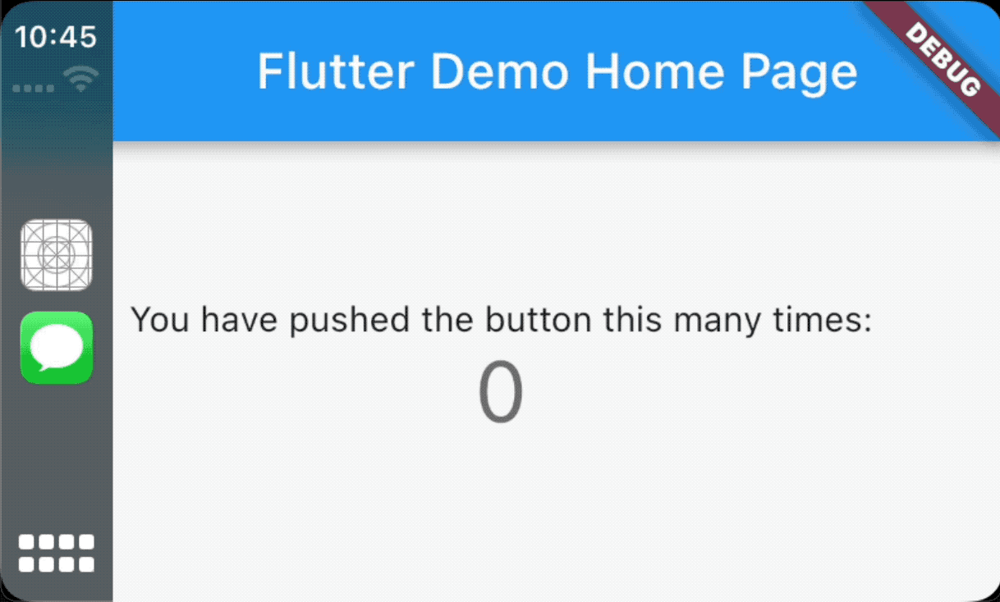

# CarPlay Flutter Widgets

## What is this?
This is a proof of concept of a Flutter based app running on Apple CarPlay app.

## What can I use it for?
You can use Flutter to build your Maps CarPlay app. You can also experiment with custom UIs (like this app) but don't expect it to be approved on the App Store unless Apple allows more custom app types on CarPlay.

## How does it work
The project is using the Map CarPlay template which allows rendering a custom UIViewController.
Flutter is being added to the existing iOS app as a Flutter module. The custom UIViewController that is provided to CarPlay is a FlutterViewController which contains the Flutter widgets.

## Limitations
While being able to render anything we want, the rendered FlutterViewController is not interactive. That means it does not respond directly to touch input. Intead we have to rely on the UI interactions that CarPlay's Map template provides. It is totally possible to customize the buttons of the Map Template (like we did with the + button) and interact with your Flutter widgets using those. You could also use touch gestures or Siri.

## Author
[Navideck](https://github.com/navideck)
